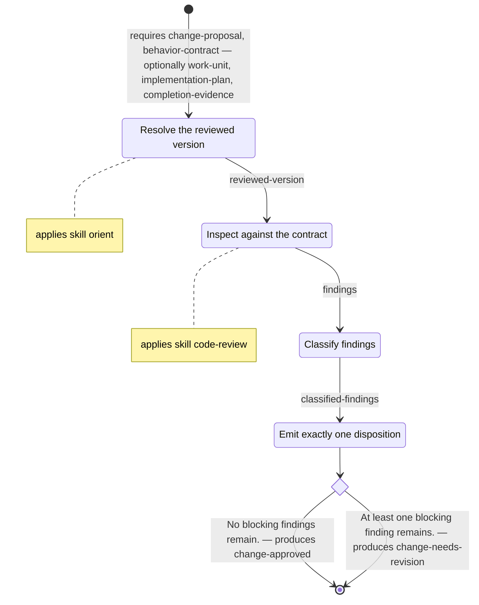

# Agent Protocols

A standard for encoding the cognitive protocols that agents execute. Each
protocol lives in one canonical model — its contract, its structure, and its
prose in a single file — and every diagram is a projection computed from it.

Status: Draft. The standard's version has a single home, the
[changelog](CHANGELOG.md).

## One Home for Each Protocol's Truth

A protocol is a repeatable cognitive process with a contracted guarantee: it
consumes artifacts that satisfy its precondition, performs a bounded piece of
work, and produces artifacts that satisfy its postcondition. A full account
of a protocol carries two kinds of knowledge — prose that teaches the work,
and structure that routes it — and the standard's central move is to give
both one home. The canonical model is a single file carrying contract, step
graph, and prose, anchored together; every other representation is a
projection computed from it. Representations that share one source agree by
construction, and the hardest-won knowledge — why this branch, when this
loop — lives beside the steps it governs.

## Three Commitments

**A contract spine.** A protocol carries its guarantee as a contract in the
design-by-contract sense: a precondition (the artifacts that must exist and
validate before it runs), a postcondition (the artifacts guaranteed to exist
and validate after), and invariants (the rules that hold at every point in
between). When the work can end in more than one way, each ending is a typed
*disposition* — a distinct artifact type, exactly one produced — so
downstream routing branches on the outcome's type, legible to readers and
machines alike.

**Declarative data-flow authoring.** The author states what each step
*needs*, what it *yields*, and what it *delegates*. Execution order is
derived from those declarations: steps whose dependencies chain are
sequential, independent steps are concurrent, typed outcomes branch, and
declared feedback dependencies loop. The dependencies are the single carrier
of ordering, so the structure a reader sees and the structure a runtime
follows are the same structure.

**Derived views.** From the canonical model, tools project an activity view
(for understanding a protocol) and a state view (for monitoring a run of
one). Each view is regenerable from the model at any time and marked as
derived; authority rests with the canonical model.

## What It Looks Like

A canonical model is one markdown file: YAML frontmatter carries the
structured model, the body carries the prose, and anchored headings
(`## Step: <id>`) tie each step's operational substance to its node in the
graph. Trimmed from [`examples/review/PROTOCOL.md`](examples/review/PROTOCOL.md):

```yaml
protocol:
  spec: "1"
  intent: Judge a submitted change independently and record exactly one typed disposition.
  contract:
    precondition:
      - change-proposal
      - behavior-contract
    postcondition:
      - { group: review-disposition, one_of: [change-approved, change-needs-revision] }
  steps:
    # … two of four steps shown
    - id: inspect-against-contract
      title: Inspect against the contract
      applies: [code-review]
      needs:
        - reviewed-version
        - behavior-contract
      yields: [findings]
    - id: emit-disposition
      title: Emit exactly one disposition
      needs:
        - classified-findings
        - reviewed-version
      outcomes:
        group: review-disposition
        one_of:
          - id: approved
            when: No blocking findings remain.
            yields: [change-approved]
          - id: needs-revision
            when: At least one blocking finding remains.
            yields: [change-needs-revision]
```

From the full model, [`tools/project.py`](tools/project.py) derives the
activity view ([`examples/review/views/activity.md`](examples/review/views/activity.md)) —
sequence from chained needs, the branch from the typed outcome group, the
skill delegations as annotations:



## How It Fits Into Tesserine

The standard core is runtime-agnostic — `spec/` names no runtime, and the
[convergence harness](tools/check.sh) keeps it that way mechanically — but
the standard grew inside the [Tesserine](https://github.com/tesserine)
ecosystem, which is its reference implementation. There,
[groundwork](https://github.com/tesserine/groundwork) is the methodology
that authors protocols and [runa](https://github.com/tesserine/runa) is the
runtime that enforces their contracts.
[`bindings/tesserine.md`](bindings/tesserine.md) records the mapping —
preconditions and postconditions onto the manifest declarations runa fails
loudly, dispositions onto required-output choices, delegation onto skills in
the [Agent Skills](https://agentskills.io) envelope — and names the gaps the
binding has not yet closed rather than papering over them.

The worked examples are not demonstrations invented for this README:
`review` and `verify` are real groundwork protocols whose prose and workflow
graphs had drifted apart in their original two-file form.
[`examples/README.md`](examples/README.md) records what the drift looked
like and what one canonical home recovered.

## Status

- The three `spec/` documents and the Tesserine binding are a **draft**;
  the version's single home is the [changelog](CHANGELOG.md).
- The schema, validator, view projector, and convergence harness are
  **implemented** and runnable today (see [Tooling](#tooling)).
- Two binding gaps are **open and recorded** in
  [`bindings/tesserine.md`](bindings/tesserine.md): invariants are stated in
  canonical models but not yet mechanically enforced by the runtime, and the
  runtime manifest is still authored by hand — held convergent with the
  canonical models by a check, not yet generated from them.
- The protocol workbench TUI is **designed, not built**:
  [`design/tui.md`](design/tui.md) specifies it; no code exists yet.

## Repository Map

| Path | What it is |
| --- | --- |
| [`spec/specification.md`](spec/specification.md) | The core standard: protocol, contract, canonical model and derived views, the two graphs, authoring discipline, conformance. Runtime-agnostic. |
| [`spec/notation.md`](spec/notation.md) | The typed-edge vocabulary, grounded in the workflow-patterns literature and Harel statecharts, and the deterministic projection rules to Mermaid. |
| [`spec/canonical-model.md`](spec/canonical-model.md) | The serialization format: frontmatter structure, body anchor grammar, and the structural validation rules. |
| [`schemas/protocol.schema.json`](schemas/protocol.schema.json) | JSON Schema for the frontmatter's shape. |
| [`bindings/tesserine.md`](bindings/tesserine.md) | The reference implementation's binding: how the standard maps onto the `runa` runtime and the `groundwork` methodology. |
| [`examples/`](examples/README.md) | Two protocols from the groundwork methodology, `review` and `verify`, expressed in the canonical model, with derived views beside them. |
| [`tools/`](tools/) | Reference tooling: instance validator, view projector, convergence harness. |
| [`design/tui.md`](design/tui.md) | Design for the protocol workbench, a TUI for authoring and visualizing canonical models. Design only — nothing is built yet. |
| [`CHANGELOG.md`](CHANGELOG.md) | The record of notable changes and the single home of the standard's version number. |

## Where to Start

- **To understand the standard**, read
  [`spec/specification.md`](spec/specification.md) — it defines every term
  the rest of the repository uses — then the
  [worked examples](examples/README.md) to see the form carrying real
  protocols.
- **To author a protocol**, work from
  [`spec/canonical-model.md`](spec/canonical-model.md) with the examples as
  templates, and gate your document with
  [`tools/validate.py`](tools/validate.py).
- **To implement a tool or a runtime binding**, the format and its
  [validation rules](spec/canonical-model.md#validation), the
  [projection rules](spec/notation.md#projection-rules), and the
  [conformance clauses](spec/specification.md#conformance) are normative;
  [`bindings/tesserine.md`](bindings/tesserine.md) shows what a binding
  records.

## Tooling

The reference tools are plain Python:

```sh
python -m venv .venv
.venv/bin/pip install -r requirements-dev.txt
```

Validate canonical models against the schema and the structural rules:

```sh
.venv/bin/python tools/validate.py examples/review/PROTOCOL.md examples/verify/PROTOCOL.md
```

Project the derived views (deterministic — same input, byte-identical
output; `--check` compares the projection against the committed views):

```sh
.venv/bin/python tools/project.py examples/review examples/verify
```

Run the full convergence harness — examples validate, committed views match
their models, Mermaid blocks render, relative links resolve, the spec core
stays runtime-agnostic, and the version stays single-homed:

```sh
tools/check.sh
```

## Grounding

The standard reasons from a small set of published foundations: Bertrand
Meyer's design by contract for the contract spine; the workflow-patterns
catalog of van der Aalst, ter Hofstede, Kiepuszewski, and Barros for the
control-flow vocabulary; and Harel's statecharts for hierarchical
composition. Skills — the cross-cutting capabilities that protocol steps
delegate to — are packaged under the sibling
[Agent Skills](https://agentskills.io) standard. The principles cited
throughout the spec live in the
[principles corpus](https://github.com/pentaxis93/principles).

## License

[MIT](LICENSE).
