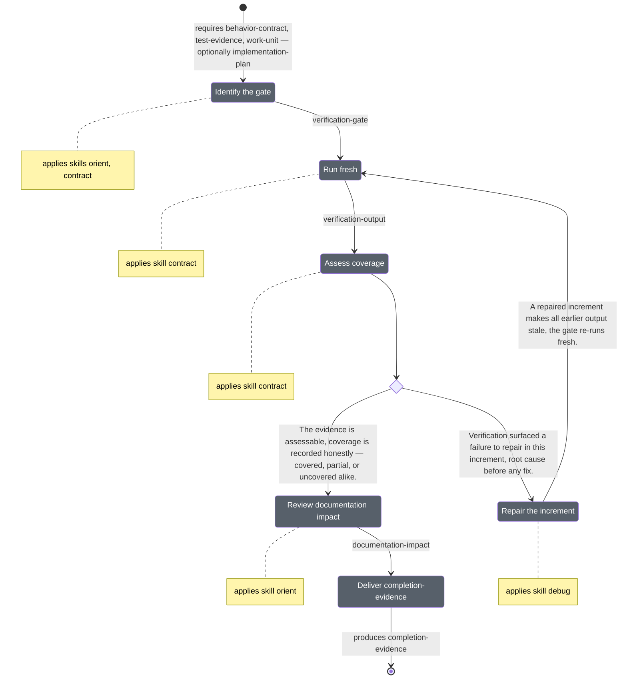

<!-- DERIVED VIEW — do not edit. Generated from ../PROTOCOL.md by tools/project.py; regenerate with: .venv/bin/python tools/project.py examples/verify -->

# verify — state view

```mermaid
stateDiagram-v2
  %% protocol: verify — derived from the canonical model
  state "Identify the gate" as identify_the_gate
  note right of identify_the_gate : applies skills orient, contract
  state "Run fresh" as run_fresh
  note right of run_fresh : applies skill contract
  state "Assess coverage" as assess_coverage
  note right of assess_coverage : applies skill contract
  state gate_result <<choice>>
  state "Repair the increment" as repair_increment
  note right of repair_increment : applies skill debug
  state "Review documentation impact" as review_documentation_impact
  note right of review_documentation_impact : applies skill orient
  state "Deliver completion-evidence" as deliver_completion_evidence
  [*] --> identify_the_gate : requires behavior-contract, test-evidence, work-unit — optionally implementation-plan
  identify_the_gate --> run_fresh : verification-gate
  run_fresh --> assess_coverage : verification-output
  assess_coverage --> gate_result
  gate_result --> review_documentation_impact : The evidence is assessable, coverage is recorded honestly — covered, partial, or uncovered alike.
  gate_result --> repair_increment : Verification surfaced a failure to repair in this increment, root cause before any fix.
  review_documentation_impact --> deliver_completion_evidence : documentation-impact
  deliver_completion_evidence --> [*] : produces completion-evidence
  repair_increment --> run_fresh : A repaired increment makes all earlier output stale, the gate re-runs fresh.
  %% status: baseline — no run in progress
  classDef complete fill:#1a7f37,color:#fff
  classDef active fill:#bf8700,color:#fff
  classDef pending fill:#57606a,color:#fff
  class identify_the_gate pending
  class run_fresh pending
  class assess_coverage pending
  class repair_increment pending
  class review_documentation_impact pending
  class deliver_completion_evidence pending
```
