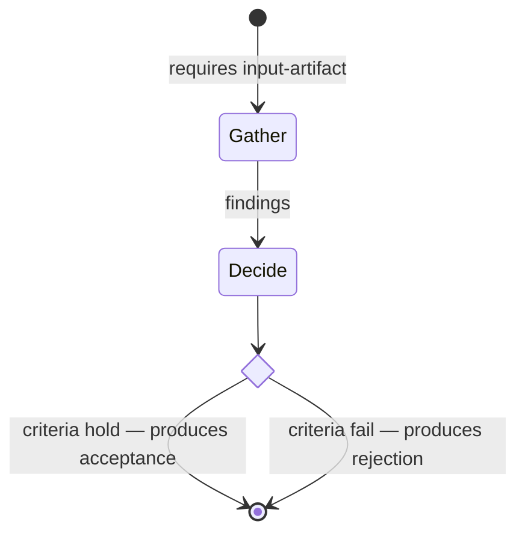
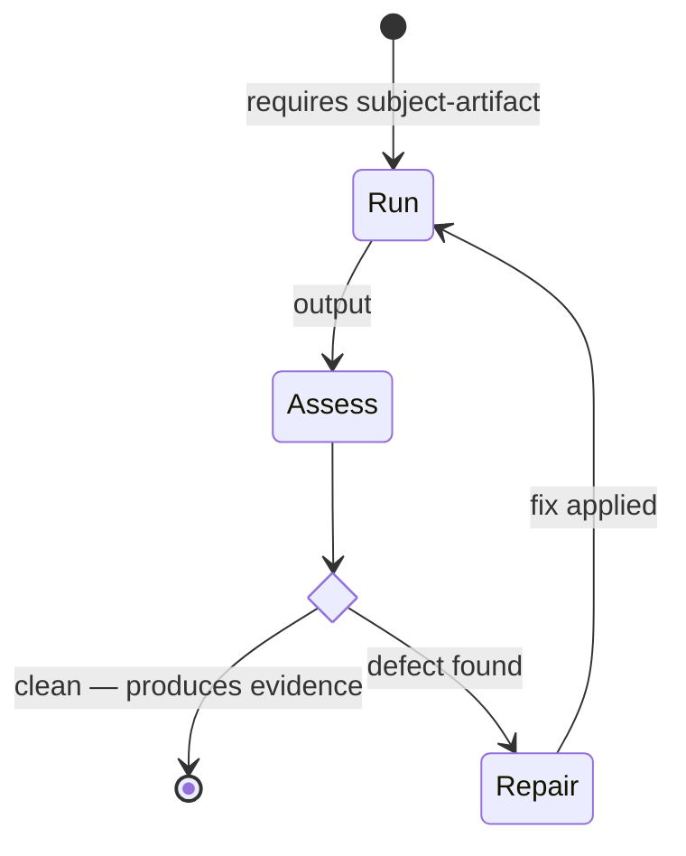
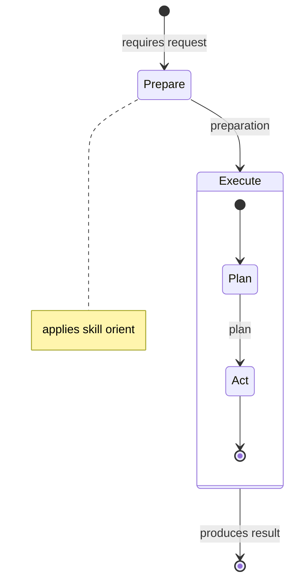
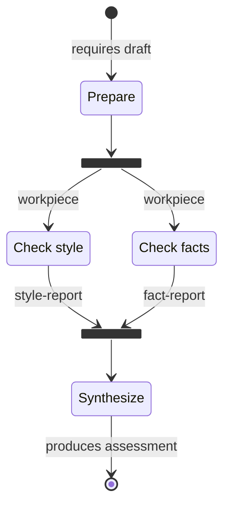
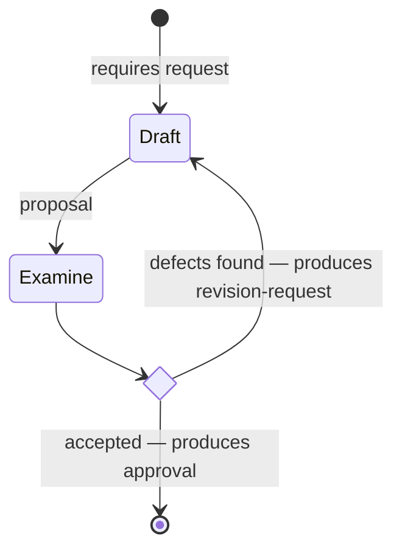

# The Agent Protocols Notation

Status: Draft

## Purpose and Scope

This document is the single home of the typed-edge vocabulary — the relation
types from which protocol graphs are built — and of the projection rules by
which a canonical model becomes its derived views. It defines semantics and
rendering; it does not define the serialization format
([canonical-model.md](canonical-model.md)) or the contract
([specification.md](specification.md#the-contract)).

## The Typed-Edge Vocabulary

The vocabulary has four families. It is grounded in the workflow patterns
catalog of van der Aalst et al. (WCP) and in Harel statecharts, rather than
invented from habit: each relation below is an established pattern with known
semantics, and the set is the smallest that carries the routing real
protocols need.

A central property of the vocabulary: **edges are never authored as edges.**
Each family has a declarative encoding in the canonical model — data
dependencies, outcome declarations, nesting, delegation references — and the
graph is derived from those declarations. The author states facts about
steps; the edges follow.

### Control flow

| Edge | Meaning | Authored as | Grounding |
| --- | --- | --- | --- |
| sequence | step B follows step A | *derived*: B needs a work product A yields | WCP-1 Sequence |
| parallel split / synchronization | steps proceed concurrently, then rejoin | *derived*: no dependency path between the steps | WCP-2 Parallel Split, WCP-3 Synchronization |
| exclusive choice | the process takes exactly one of several typed branches | a step's `outcomes` group: two or more options, each yielding distinct types, exactly one produced | WCP-4 Exclusive Choice |
| simple merge | branches that exclude each other converge | a need of the form `any_of`, satisfied by whichever branch ran | WCP-5 Simple Merge |
| loop-back | downstream work re-enables an upstream step | a need marked `feedback`, closing a cycle in the dependency graph | WCP-21 Structured Loop |

Each outcome option carries a one-line guard (`when`) and each feedback need
may carry one: the guard is prose for the reader, not an expression for a
machine. Machine routing happens only at the granularity of the produced
artifact's *type* — that is what keeps guards one line of wisdom rather than
a programming language.

### Composition

| Edge | Meaning | Authored as | Grounding |
| --- | --- | --- | --- |
| decomposes-into | a composite step contains sub-steps | nested `steps` under a step | Harel statecharts: hierarchical (composite) states |

Composition is the zoom: the same graph read at a deeper resolution. A
composite step is a complete sub-graph with the same semantics as the
protocol's top level.

### Delegation

| Edge | Meaning | Authored as | Grounding |
| --- | --- | --- | --- |
| applies-skill | a leaf step applies a named skill | `applies` on a leaf step | the protocol/skill boundary ([specification](specification.md#definitions)) |

Delegation is where depth leaves the protocol: the step keeps a thin
contract, the skill owns the mastery.

### Data

| Edge | Meaning | Authored as | Grounding |
| --- | --- | --- | --- |
| consumes / produces | a step (or protocol) reads or guarantees a named thing | `needs` / `yields` on steps; the contract at the protocol boundary | the workflow data perspective (Russell et al.); design by contract |

Data is the family the two graphs share: inside a protocol the edges carry
work products between steps; between protocols they carry artifacts, and a
runtime computes them from the protocols' contracts.

## Projection Rules

A projection is a function from a validating canonical model to a view. Two
views are defined.

Rules common to all projections:

1. **Determinism.** The same canonical model MUST project to byte-identical
   view text. Iteration order is document order; derived order is the
   topological order of the dependency graph with document order breaking
   ties.
2. **Derived marking.** Every emitted view MUST carry a marker identifying it
   as derived and naming its source. Committed views are regenerated and
   compared, never edited.
3. **Transitive reduction.** Sequence edges are drawn from the transitive
   reduction of the dependency graph: an edge that is implied by a chain is
   not drawn.

### The activity view

The activity view answers: *what happens, in what order, where does it
branch, where does it loop.* Mapping from canonical elements to Mermaid
`stateDiagram-v2`:

| Canonical element | Mermaid image |
| --- | --- |
| step | `state "Title" as <id'>` — `<id'>` is the step id with `-` replaced by `_`; the projector MUST fail on mangled-id collision |
| composite step | `state <id'> { … }` containing the recursive projection of its sub-steps, with its own `[*]` entry |
| protocol precondition | `[*] --> <entry> : requires <…>` — with one entry step (a step whose required needs are all external), the label carries the full precondition, required entries first, then `— optionally` the optional ones; with several entry steps, each carries its own required externals |
| sequence edge | `<a> --> <b> : <work products carried>` |
| parallel split / synchronization | `state <id'>_fork <<fork>>` after a step whose reduced plain out-edges fan to several steps; `state <id'>_join <<join>>` before a step that receives several plain in-edges from sources that are not mutually exclusive (exclusive sources are a simple merge and get no pseudostate) |
| outcomes group | `state <group'> <<choice>>`; `<step> --> <group'>`; one transition per option labeled with its `when` |
| outcome or yield that exits the protocol | `… --> [*] : <when> — produces <artifact type>` |
| feedback need | `<source> --> <target> : <when or work product>`, drawn as a loop-back |
| applies-skill | `note right of <id'> : applies skill <name>` |
| simple merge (`any_of`) | the merging step receives one transition per excluding branch; no pseudostate |

Rendering degradations, prescribed: Mermaid is a rendering, never a source,
so its lexical limits constrain emitted labels, not authored prose. In
labels, whitespace collapses to single spaces, and semicolons — statement
separators in the dialect — are rendered as commas. The canonical text is
always the model's; a label is its image under these rules.

Construct miniatures (each block below is itself conformant Mermaid):

Sequence and exclusive choice:



Loop-back and merge:



Composition and delegation:



Parallelism:



### The state view

The state view answers: *what condition is this run in.* It has the same
topology as the activity view — one projection function, two inputs — plus a
status classification per step, derived from which declared outputs exist:

- `complete` — every externally-bound yield reachable from the step
  (including through its taken outcome option) exists and validates;
- `active` — the executing session reports the step current (where a runtime
  provides this signal);
- `pending` — otherwise.

Statuses are emitted as Mermaid classes appended to the shared topology:

```text
classDef complete fill:#1a7f37,color:#fff
classDef active fill:#bf8700,color:#fff
classDef pending fill:#57606a,color:#fff
class resolve_reviewed_version complete
```

The honest boundary of this view: only the externally-bound outputs are
machine-guaranteed; status inferred for internal-only steps is exact only
with session cooperation. The view states what it knows and no more.

### Losslessness

"Round-trips losslessly" means three checkable properties, verified by the
reference projector:

1. **Totality** — every validating canonical model projects to every view
   without error.
2. **Faithfulness** — every element of an emitted view is the image of a
   canonical element under the mapping tables above; nothing is invented.
3. **Coverage** — every element of the model's structural core appears in at
   least one view, per the matrix below; nothing structural is lost.

| Canonical element | Activity view | State view | Canonical document |
| --- | --- | --- | --- |
| step, composition | ✓ | ✓ | ✓ |
| sequence / parallelism (derived) | ✓ | ✓ | derivable |
| outcome groups and guards | ✓ | ✓ (taken branch) | ✓ |
| feedback edges and guards | ✓ | ✓ | ✓ |
| delegation | ✓ | ✓ | ✓ |
| contract (pre/postcondition) | ✓ (entry/exit labels) | ✓ (status ground) | ✓ |
| invariants, corruption modes, prose | — | — | ✓ (canonical only) |

Prose, invariants, and corruption modes are canonical-only by design: the
canonical document *is* the reading view. Views are projections of structure,
not abridgments of wisdom.

The reverse direction does not exist: there is no view-to-model parser, and
conforming tools never persist a view as a source of truth
([specification](specification.md#one-canonical-model-derived-views)).

## Rendering the Inter-Protocol Graph

The graph of protocols — which consumes what, which produces what, where
dispositions route — is computed by a runtime from the protocols' declared
contracts. This standard renders that computation; it never authors it. A
rendered inter-protocol diagram MUST be marked *computed*, naming the
source of the computation; an unmarked or hand-drawn inter-protocol diagram
asserts nothing.

The rendering profile reuses the same vocabulary at protocol resolution:
protocols are states, artifact types label the data edges, a disposition
group is a `<<choice>>` whose options are its member types, and a disposition
that re-enables an earlier protocol renders as a loop-back:



Composition is what joins the two resolutions: zooming into a protocol state
yields that protocol's intra-protocol graph, rendered by the
[activity view](#the-activity-view) rules. One notation, one continuous
graph, two distances from it.

## Evolution

Mermaid `stateDiagram-v2` is the rendering dialect of this version because it
renders where protocols live (plain repositories), supports composite states,
choice pseudostates, fork/join, and entry/exit markers, and is reliably
machine-generatable. It is a rendering, never a source. The vocabulary above
is deliberately serialization-independent — each relation is anchored to a
WCP or Harel construct with a defined image in richer notations (exclusive
choice → exclusive gateway, composition → subprocess, delegation → call
activity, data → data objects), so a future projection to such a notation is
a new profile beside this one, not a migration of authored models.
